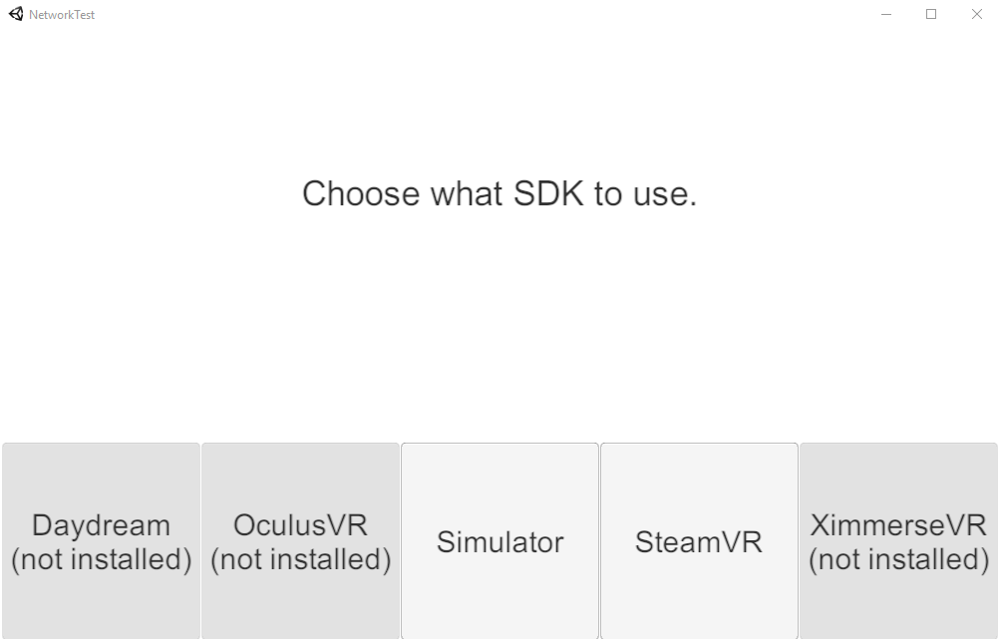

# VRTK-PUN-NetworkTest
A small test project showing how to sync VR CameraRig objects using [Photon's PUN](https://www.photonengine.com/en-US/PUN) and [VRTK](https://github.com/thestonefox/VRTK).

## Setup

To be able to use this example project you'll have to set it up first:

1. Open the project in Unity.
2. In the menu bar click on `Window > Photon Unity Networking > Highlight Server Settings`.
3. In the `Inspector` window change the `AppId` field to your own one you got from Photon.
4. Open the scene `TestScene` found in the `Scenes` folder in the `Project` window.
5. Hit Play!

## Testing locally

To test locally without another computer you can create a standalone build:

1. Either click on `File > Build & Run` or:
    1. In the menu bar click on `File > Build Settings...`.
    2. Click the `Build And Run` button, choose a destination folder and name your executable.
2. Run the build executable.
3. Hit Play in the Editor!

This means you now have two copies of the game running at the same time, one standalone and one in the Editor.

## Unity version info

This project was created with Unity 5.4.4f1 but should work in all the above versions (including the latest beta of 5.6.0), too. Make sure to allow Unity to upgrade the project when you open it.
